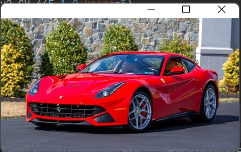

# Edge-Detection
## Aim:
To perform edge detection using Sobel, Laplacian, and Canny edge detectors.

## Software Required:
Anaconda - Python 3.7

## Algorithm:
### Step1:
<br>


### Step2:
<br>

### Step3:
<br>

### Step4:
<br>

### Step5:
<br>

 
## Program:

``` Python
# Import the packages
import cv2
import matplotlib.pyplot as plt


# Load the image, Convert to grayscale and remove noise
image = cv2.imread("car.jpeg")
grayImage = cv2.cvtColor(image,cv2.COLOR_BGR2GRAY)
cv2.imshow("OriginalImage",image)
cv2.imshow("GrayscaleImage",grayImage)
smoothImage = cv2.GaussianBlur(grayImage,(3,3),0)


# SOBEL EDGE DETECTOR
sobelx = cv2.Sobel(smoothImage,cv2.CV_64F,1,0,ksize=5)
sobely = cv2.Sobel(smoothImage,cv2.CV_64F,0,1,ksize=5)
sobelxy = cv2.Sobel(smoothImage,cv2.CV_64F,1,1,ksize=5)


# LAPLACIAN EDGE DETECTOR
laplacian = cv2.Laplacian(smoothImage,cv2.CV_64F)


# CANNY EDGE DETECTOR
cannyEdges = cv2.Canny(smoothImage,120,150)

plt.figure(1)
plt.subplot(2,2,1)
plt.imshow(smoothImage,cmap = 'gray')
cv2.imshow("sobelx",sobelx)
cv2.imshow("sobely",sobely)
cv2.imshow("sobelxy",sobelxy)
cv2.imshow("Laplacian",laplacian)
cv2.imshow("Canny Edges",cannyEdges)
plt.title("Original")
plt.xticks([])
plt.yticks([])
plt.show()


```
## Output:
### SOBEL EDGE DETECTOR



### LAPLACIAN EDGE DETECTOR

### CANNY EDGE DETECTOR


## Result:
Thus the edges are detected using Sobel, Laplacian, and Canny edge detectors.
